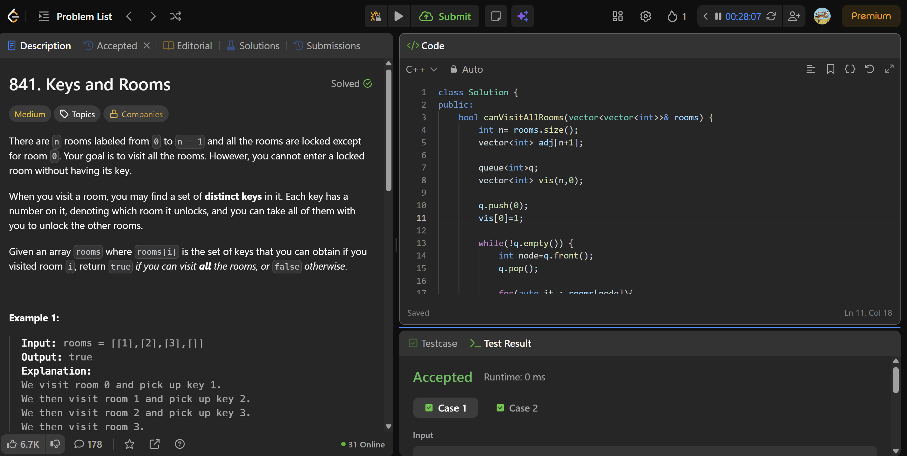

# 841. Keys and Rooms 
> **Difficulty:**  easy
> **Topics:** bfs

---

##  Approach

### Algorithm

1. rooms is our adjacency list
2. bfs
3. if any element in vis array is 0, return false (that room stayed unlocked)
4. if not, return true

### Mistakes

- rooms arr was already the adjacency list, i remade one (incorrectly)
- the graph is directed, the following shows an undirected graph
       adj[u].push_back(v);
       adj[v].push_back(u);

---

## ⏱ Complexity

| Time | Space |
|------|-------|
| `O(V+E)` | `O(V)` |

---

##  Takeaways
Whenever you see something like

vector<vector<int>> graph;

or

rooms[i] = {neighbors...}

or

adj[i] = {...}

don't rebuild the graph. Traverse it directly.
