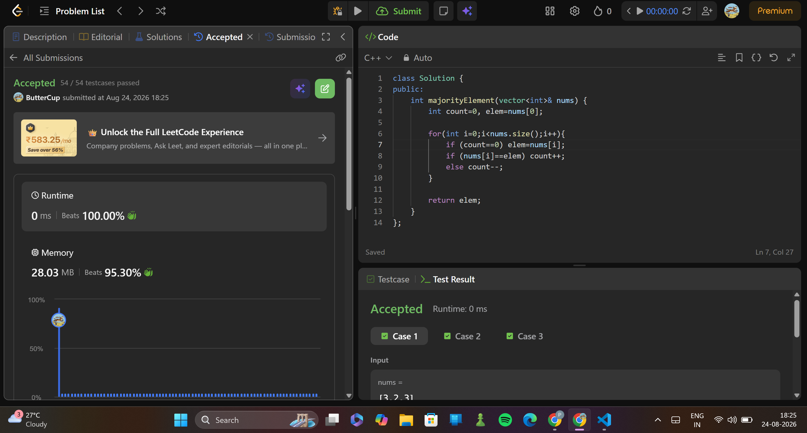

# 169. Majority Element
> **Difficulty:**   easy
> **Topics:** array, sorting, hashing
> **Pattern:** Moore's Voting Algo
> **Link:**https://leetcode.com/problems/majority-element/

---

## First Approach

### Key Insight

the majority element appears >n/2 times, so if the array is sorted, it should be in the middle.

### Algorithm

1. sort nums.
2. return mid elem.

### Why it works

the other elemnts fill up the spaces in the front and the back, and the middle n/2 elements will be our ans.

---

## ⏱ Complexity

| Time | Space |
|------|-------|
| `O(nlogn)` | `O(1)` |

---

## Moore's Voting Algo Approach

### Algorithm
1. Initialize two variables: count and candidate. Set count to 0 and candidate to an arbitrary value.
2. Iterate through the array nums:
a. If count is 0, assign the current element as the new candidate and increment count by 1.
b. If the current element is the same as the candidate, increment count by 1.
c. If the current element is different from the candidate, decrement count by 1.
3. After the iteration, the candidate variable will hold the majority element.

### Why it works

The algorithm works on the basis of the assumption that the majority element occurs more than n/2 times in the array. This assumption guarantees that even if the count is reset to 0 by other elements, the majority element will eventually regain the lead.

a. If the current element matches the candidate, it suggests that it reinforces the majority element because it appears again. Therefore, the count is incremented by 1.
b. If the current element is different from the candidate, it suggests that there might be an equal number of occurrences of the majority element and other elements. Therefore, the count is decremented by 1.

---

## ⏱ Complexity

| Time | Space |
|------|-------|
| `O(n)` | `O(1)` |

## submission
