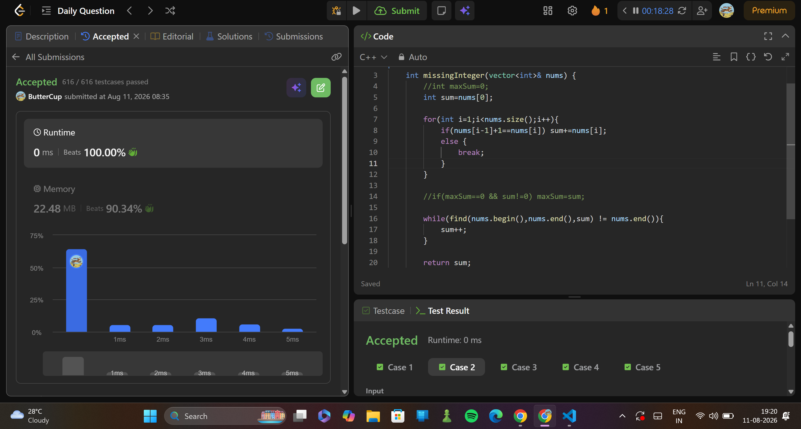

# 2996. Smallest Missing Integer Greater Than Sequential Prefix Sum
> **Difficulty:**   easy
> **Topics:** array
> **Link:**https://leetcode.com/problems/smallest-missing-integer-greater-than-sequential-prefix-sum/description/?envType=daily-question&envId=2026-08-11

---

##  Final Approach

### Algorithm

1. take sum till elements are sequential digits, only prefix is needed
2. run another loop till the int greater than or equal to sum is found

---

## ⏱ Complexity

| Time | Space |
|------|-------|
| `O(n^2)` | `O(1)` |

---
