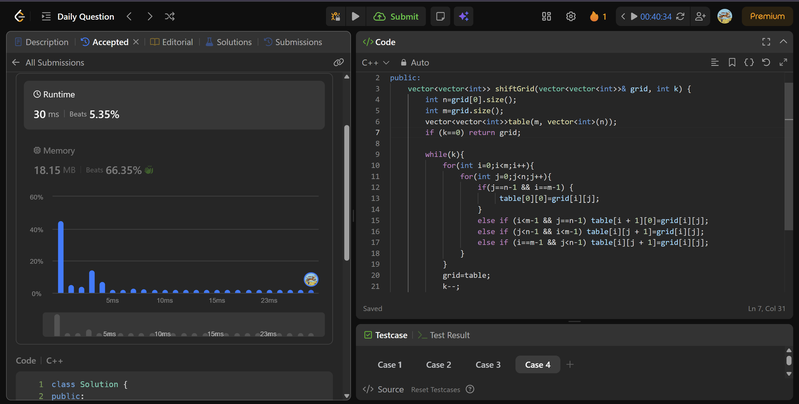

# num. name 
> **Difficulty:**   
> **Topics:** 
> **Pattern:** 

---
##  Approach

### Key Insight

a matirx is just another array

### Algorithm

1. declare an empty vector table of the same size as input vector grid.
2. for elements at each position shift them by 1, if an element is at [i][n-1] in grid, its new position will be [i+1][0] in table.
3. after each shift, make gird=table so the next shift occurs in the new matrix instead of the original one.

### Mistakes
- vector declaration
- didnt  make gird=table

---

## ⏱ Complexity

| Time | Space |
|------|-------|
| `O(kmn)` | `O(mn)` |

---

##  Takeaways

- Vector Declaration
        int rows = 3, cols = 4;
        vector<vector<int>> grid(rows, vector<int>(cols));

