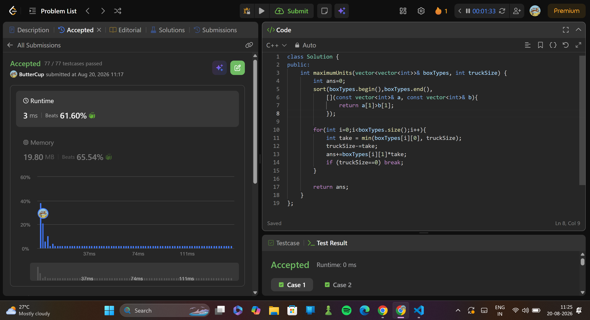

# 1710. Maximum Units on a Truck
> **Difficulty:**   mid
> **Topics:**  greedy, custom sort
> **Link:** https://leetcode.com/problems/maximum-units-on-a-truck/description/

---

##  Approach

### Key Insight
knapsack problem -truck size is knapsack's capacity
                - numberOfBoxesi is the wieght
                - numberOfUnitsPerBoxi is the profit for EACH (dont need a profit by weight arr here)
objective is to maximise number of units that can be put on the truck.

### Algorithm

1. sort boxTypes arr based on decreasing order of the second element of each vector in boxTypes. 
2. for each boxtype, calculate the num of boxes to be taken by choosing the min of trucksize and available box of the ith type. 
3. on each iteration, decrease trucksize by take and increase ans by (num of units in each boxtype)*take.
4. when trucksize becomes 0, exit.

---

## ⏱ Complexity

| Time | Space |
|------|-------|
| `O(nlogn)` | `O(1)` |

---

##  Takeaways

- map- unique keys,keys are sorted
  multimap- keys can be duplicate but are sorted. mpp[key]=val, cant be used. use mpp.insert({key,val}).
  unordered_map- unique unsorted keys.
- Lambda function- 
          [capture_list](parameters) {
              // code
          }

##  Submission
