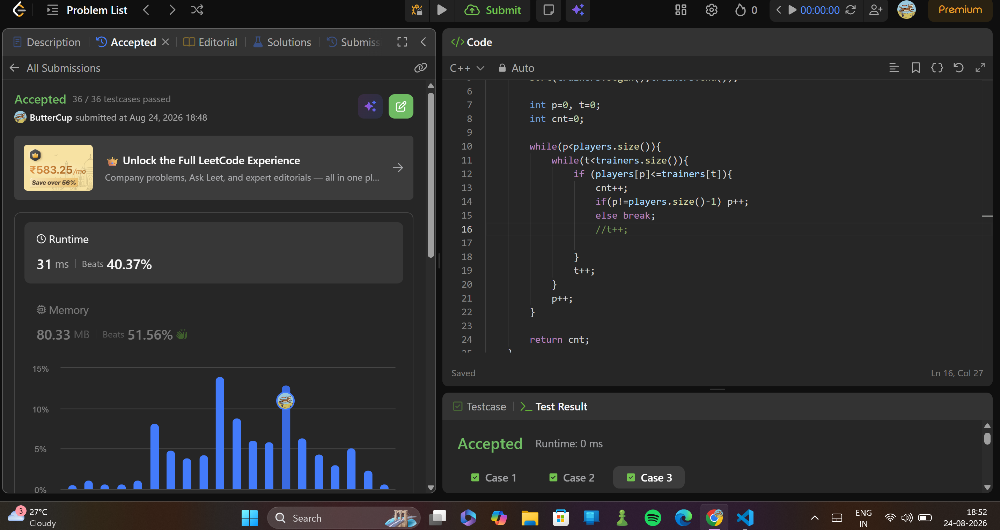

# 2410. Maximum Matching of Players With Trainers
> **Difficulty:**   easy
> **Topics:** sorting, array
> **Pattern:** greedy, two pointers
> **Link:**https://leetcode.com/problems/maximum-matching-of-players-with-trainers/description/

---

##  Approach

### Key Insight

very similar to assign cookies.

### Algorithm

1. sort both the arrays and initialise a counter.
2. check each player with each trainer till a match is found and inc counter.
3. return counter

---

## ⏱ Complexity

| Time | Space |
|------|-------|
| `O(nlogn +mlogm)` | `O(1)` |

---

## submission
