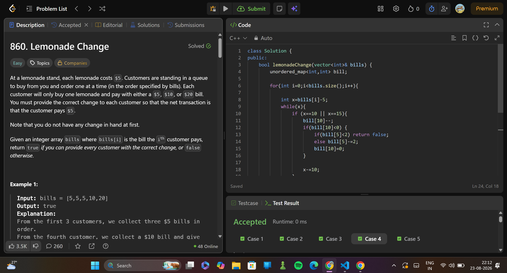

# 860. Lemonade Change
> **Difficulty:**   mid
> **Topics:** greedy
> **Link:**https://leetcode.com/problems/lemonade-change/description/

---

##  Approach

### Key Insight
always use largest denomination money first for giving the change
for each bill, compute the change and inc/dec the corresponding freq

### Algorithm

1. if the bill is of 5$, increase the freq of 5$ bills.
2. if the bill is of 10$, increase freq of 10$ bills
                          decrease freq of 5$ bills
                          if 5$ bills are unavailable, return false
3. if the bill is of 20$, decrease freq of 5$ bills and 10$ bills. 
                          if 10$ bills are unavailable, dec freq of 5$ bills by 3.
                          if 5$ bills are unavailable, return false

---

## ⏱ Complexity

| Time | Space |
|------|-------|
| `O(n)` | `O(1)` |

---

## submission
