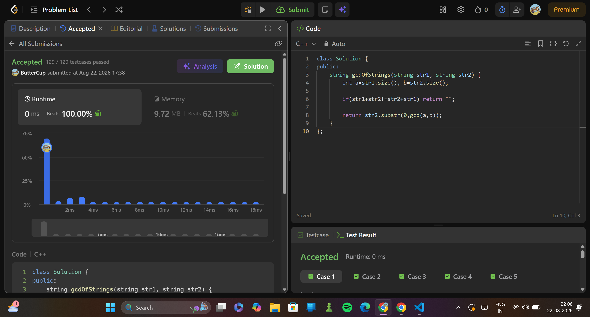

# 1071. Greatest Common Divisor of Strings
> **Difficulty:**   mid
> **Topics:** strings, maths, gcd
> **Link:**https://leetcode.com/problems/greatest-common-divisor-of-strings/description/

---

## First Approach

### Key Insight
Eucliden ALgorithm for finding GCD but in strings.
    - gcd of 2 nums cant be hreater than the two nums so we start w appointing the smaller num as our result.
    - if result fully divides a and b (result is a divisor of both a and b) we have our gcd
    - else with decrease result by one and keep looking. 

### Algorithm

1. Compute size of both strings, naming the smaller string as x and the longer string as y.
2. If both the strings have same lengths, we check if they're the same, if yes, bingo.
                                                                        if not, return "".
3. using two ptrs- i= starting pointer (initially, i=0)
                   j= size of x.
4. for each x, 
          - we check if substring of y with position i and len j 
          - if matched, inc i by j.
                        if i+j (end ptr) exceedes size of y, ie, each substr matches, x is our answer
          - if not mathced decrease x by removing the last char from it and reset i and j.
5. if we dont get an answer beofre x becomes empty, return "".

### Why it works
it doesnt,
we also need to check whether x can divide the original shorter string.

which is like the same algo again but for the shorter string nuh uh.

I was also treating j as the end ptr earlier in some places but then the size in other places wow
---

## summary
1. x = shorter string
2. check whether x repeatedly appears in y
3. shrink x

##  Final (Copied, but understood) Approach

### Key Insight

.if structure of both string doesnt match, they wont have a gcd.

### Algorithm

First we check if str1 + str2 == str2 + str1
If it is equal than if find the longest common substring.
Otherwise we return "".

---
## ⏱ Complexity

| Time | Space |
|------|-------|
| `O(n+m)` | `O(n+m)` |

---

##  Takeaways

- The time complexity of the substr function is O(K) and the space complexity is O(K), where K is the length of the requested substring.
- Time and SPace for COncatenating strings are both O(n+m), where n and m are sizes of both strings
        Because concatenation has to create a new string and copy all n + m characters into it.
- #include <numeric> library for gcd.

##  Submission
