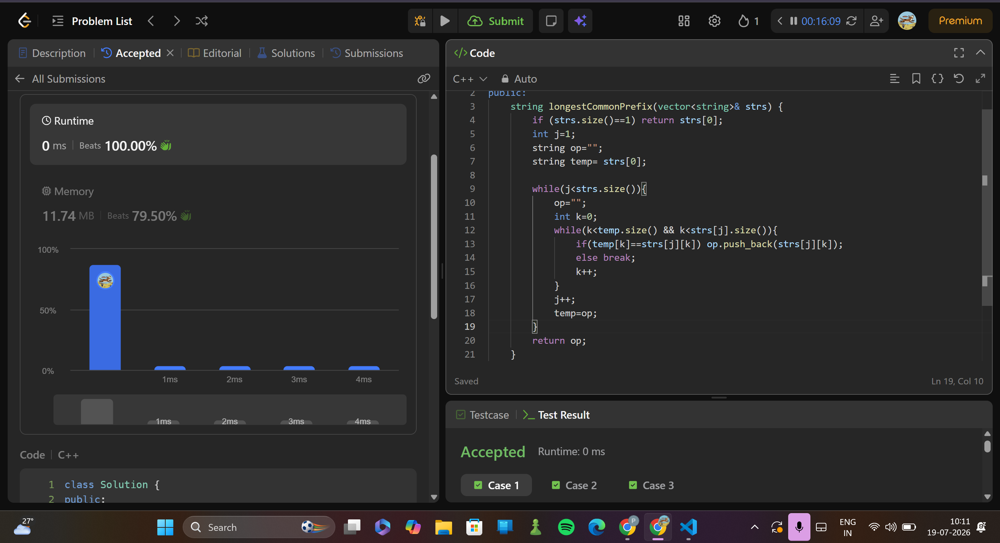

# 14. Longest Common Prefix 
> **Difficulty:**   easy
> **Topics:** strings

---

##   Approach

### Key Insight

keeping a variable temp which starts with holding the string at the first position of the input vector, then gets updated to hold the longest coommon prefix.

### Algorithm

1. initialise an empty string op.
2. initialise a variable temp with firts string of the input array.
3. compare the char on next string with corresponding char on temp
      - if both the chars match, push to op.
      - if not, break the current iteration of the loop
4. update temp to be op
5. repeat the process for every string in the array, resetting op="" for each.
6. output op.

---

## ⏱ Complexity

| Time | Space |
|------|-------|
| `O(n*m)` | `O(m)` |

---
